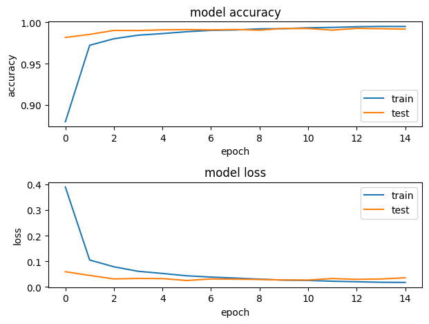
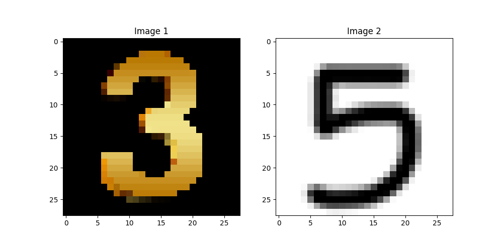

# MNIST Digit Recognition

## Overview

This project aims to build a machine learning model that can accurately recognize handwritten digits from the MNIST dataset.

The MNIST dataset consists of 70,000 grayscale images of handwritten digits (0 to 9), each of size 28x28 pixels. The dataset is split into a training set of 60,000 images and a test set of 10,000 images.

## Requirements

The project requires Python 3.7 or above, along with several libraries including:

- opencv
- numpy
- matplotlib
- tensorflow
- keras

## Accuracy



```
Test loss: 0.03573758900165558
Test accuracy: 0.9918000102043152
```

## Usage

Run `MNIST_digit_recognition_model.py` to obtain `test_model.h5` test data.

You can test your data with `classification.py`.



As default, i tested the model with this 2 images.

### Author

- LinkedIn - [Ömer Fatih Bülbül](https://www.linkedin.com/in/ömer-fatih-bülbül-74a890236/)
- Twitter - [fatihbulbul91](https://twitter.com/fatihbulbul91)
